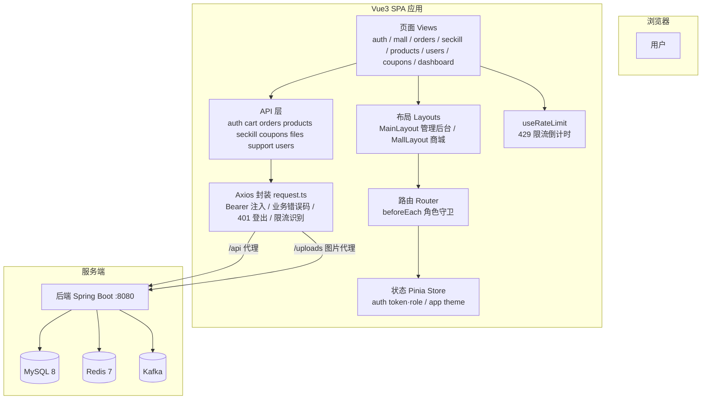
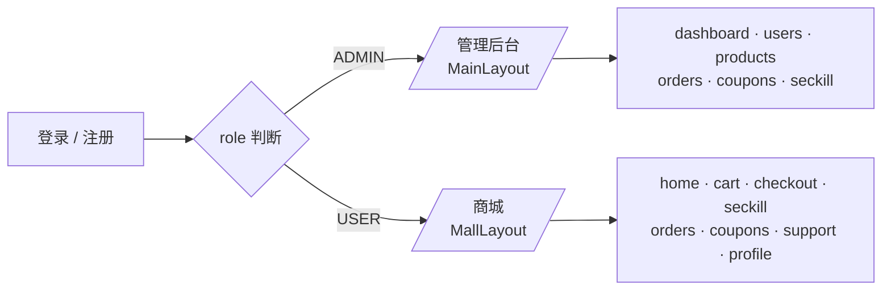
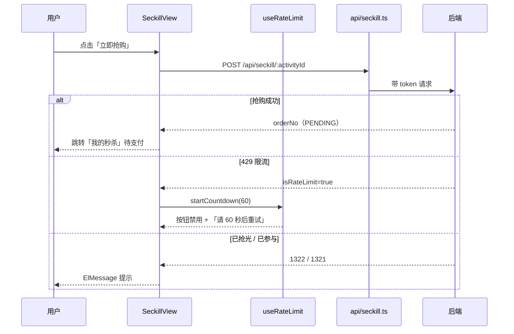
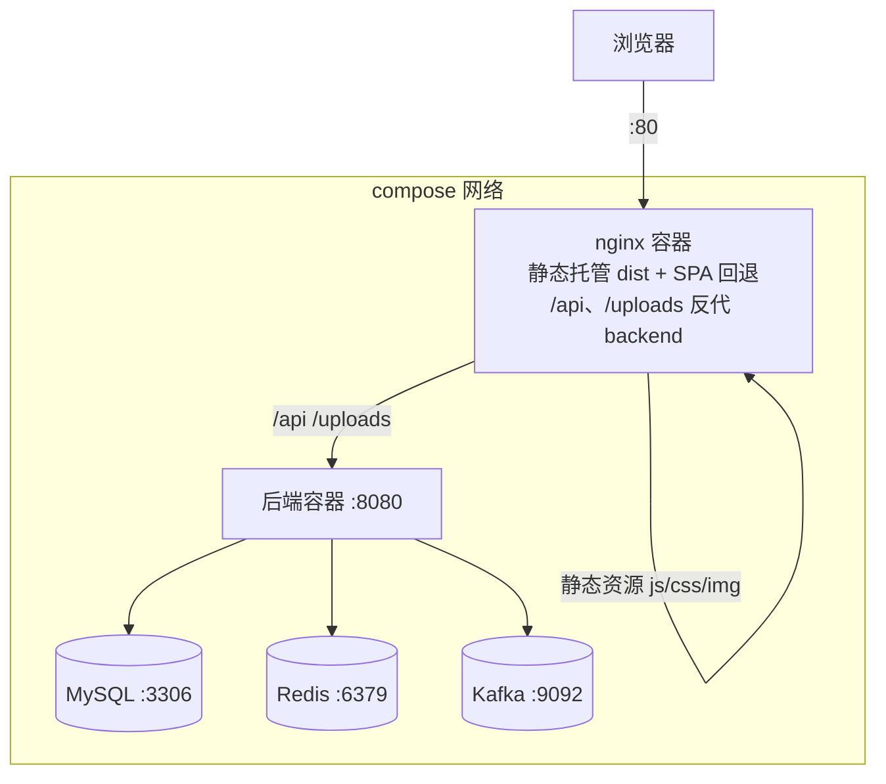

# LinkForge 前端架构详解

> 本文档基于**实际代码**编写（2026-08 版本），描述双端架构、路由守卫、状态管理、样式体系与关键页面实现。

## 0. 系统架构图



- **单仓库双端**：一套 Vue3 代码，通过路由布局壳区分管理后台（ADMIN）与商城（USER）
- **请求链路**：页面 → API 模块 → Axios 拦截器（自动带 token）→ vite/nginx 代理 → 后端
- **前端不做计价**：金额仅展示，最终以服务端计算为准（后端防篡改）
- **限流联动**：接口 429 时 `useRateLimit` 启动倒计时，禁用按钮防止继续请求

## 1. 双端架构



```
登录后按角色分流（LoginResponse.role 持久化到 Pinia）
        │
        ├── ADMIN ──► / 管理后台（MainLayout）
        │              dashboard / users / products / orders / coupons / seckill
        │
        └── USER  ──► /mall 商城（MallLayout）
                       home / cart / checkout / seckill / orders / coupons / support / profile
```

- 同一套代码，两个布局壳（`layouts/MainLayout.vue` 后台侧边栏、`layouts/MallLayout.vue` 商城顶栏）
- 复用页面：订单列表（后台=管理视图，商城=我的订单）、优惠券中心、秒杀页（后台=管理视图）
- 后端对 USER 强制查本人订单，前端无需区分查询范围

## 2. 路由守卫（角色化四步）

`src/router/index.ts` 的 `beforeEach`：

| 场景 | 行为 |
|------|------|
| 未登录访问需认证页 | → `/login?redirect=原路径` |
| 角色与 `meta.roles` 不符（如 USER 撞管理路由） | ADMIN → `/dashboard`，USER → `/mall/home` |
| 已登录访问登录/注册页 | 按角色跳首页 |
| 其余 | 放行 |

路由表元信息：`/` 根路由 `roles:['ADMIN']`、`/mall/**` `requiresAuth: true`。

## 3. 状态管理（Pinia）

| Store | 状态 | 说明 |
|-------|------|------|
| `auth` | token / user(nickname, role) | token 持久化 `localStorage`；`isAdmin` 由 role 计算；旧登录态无 role 按 USER 处理 |
| `app` | theme (light/dark) | 主题切换持久化，注入 `data-theme` 驱动 CSS 变量 |

## 4. 请求层（api/request.ts）

```mermaid
sequenceDiagram
    participant V as 页面组件
    participant ST as Pinia auth
    participant A as api/xxx.ts
    participant AX as Axios 拦截器
    participant P as vite/nginx 代理
    participant B as 后端

    V->>A: 调用业务接口函数
    A->>ST: 读取 token
    ST-->>A: token
    A->>AX: request(url, method, data)
    AX->>AX: 注入 Authorization: Bearer token
    AX->>P: GET/POST /api/xxx
    P->>B: 转发至 localhost:8080
    B-->>P: Result&lt;T&gt;（code, message, data）
    P-->>AX: JSON 响应
    AX->>AX: code !== 200 → ElMessage 错误提示<br/>isRateLimit → 标记限流错误<br/>HTTP 401 → 清登录态跳登录
    AX-->>V: 返回 data（业务成功）
```

- axios 实例：`baseURL = import.meta.env.VITE_API_BASE_URL || '/api'`（相对路径，适配 vite 代理与 nginx）
- 请求拦截器：自动注入 `Authorization: Bearer <token>`；401 时清登录态跳登录页
- 响应拦截器：统一 `code!==200` 的 ElMessage 错误提示

## 5. 样式体系（Design Token）

`src/styles/main.css` 定义 CSS 变量（主色 `#4F6BFF`）：

```css
:root { --primary:#4F6BFF; --gradient-brand:linear-gradient(...); --radius-md:8px; ... }
[data-theme="dark"] { --bg:#0f1115; --text:#e8eaf0; ... }
```

- 组件与页面一律引用变量，主题切换全局生效
- 官网风格：渐变 hero、卡片（app-card）、大留白、响应式（≤768px 导航折叠）

## 6. 关键页面实现

### 商城首页（MallHomeView）
- 商品网格：`ProductImage`（无图占位回退）、价格格式化、库存显示
- 商品卡片双按钮：**加入购物车**（POST /api/cart） / **立即购买**（→ `/mall/checkout?productId=&qty=`）
- 秒杀专区：活动卡片 + 倒计时文案 + 抢购入口

### 购物车（CartView）→ 结算（CheckoutView）
- CartView：全选/数量 stepper/删除/合计，勾选项 `ids` 传结算页
- CheckoutView 双入参：
  - `?from=cart&ids=1,2,3`：从购物车选中项组装 items
  - `?productId=1&qty=2`：立即购买单商品
- 提交 `POST /api/orders {items, couponId}` → 成功后清购物车 → 跳订单详情
- 金额前端展示、**服务端最终计价**

### 我的秒杀（OrderListView 内 Tab）
- 抢购成功 PENDING → [支付][取消]；PAID → [退款]；其余 → 详情
- 操作后刷新列表；状态映射含 PENDING/PAID/CANCELLED/REFUNDED/FAILED

### 秒杀抢购时序（前端视角）



### 订单操作（后台）
- ADMIN：PENDING 支付/取消、PAID **发货**、创建订单弹窗（代下单，含券/备注）
- USER：SHIPPED **确认收货**、详情

### AI 客服（SupportView）
- 聊天界面：气泡消息、快捷问题 chips、输入发送（Enter）
- 后端 ChatProvider 路由（DeepSeek 真实模型 / Mock 规则兜底）

## 7. 构建与部署



| 命令 | 说明 |
|------|------|
| `npm run dev` | 开发（vite 代理 /api → localhost:8080） |
| `npm run type-check` | vue-tsc 严格类型检查（0 错误基线） |
| `npm run build` | 产物 `dist/` |
| Docker | `Dockerfile`（node:22 构建 → nginx）+ `nginx.conf`（静态托管 + /api、/uploads 代理 + SPA 回退） |

## 8. 目录速查

```
src/
├── api/            # 11 个接口模块（request 封装 + 各业务域）
├── components/     # StatusTag / ProductImage / ProductFormDialog / SeckillCreateDialog / PageHeader / EmptyState / AppAvatar
├── constants/      # 状态映射（订单/秒杀/用户/商品）
├── layouts/        # MainLayout（后台）/ MallLayout（商城）
├── router/         # 路由表 + 角色守卫
├── stores/         # auth / app
├── styles/         # Design Token + 全局（亮/暗双主题）
├── types/          # 全部 TS 类型（与后端 DTO 对齐）
├── utils/          # format（金额/日期）
└── views/          # auth / mall / seckill / orders / products / users / coupons / dashboard
```
